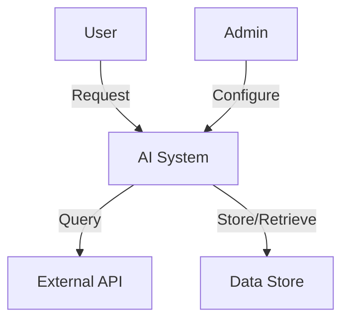

# Context Diagram

## System context

Document the high-level system context showing:

- External actors/users
- System boundaries
- External integrations
- Data flows between system and external entities

## Instructions

Replace this placeholder with your context diagram using:

- Mermaid
- PlantUML
- Draw.io export
- ASCII art

## Example format

